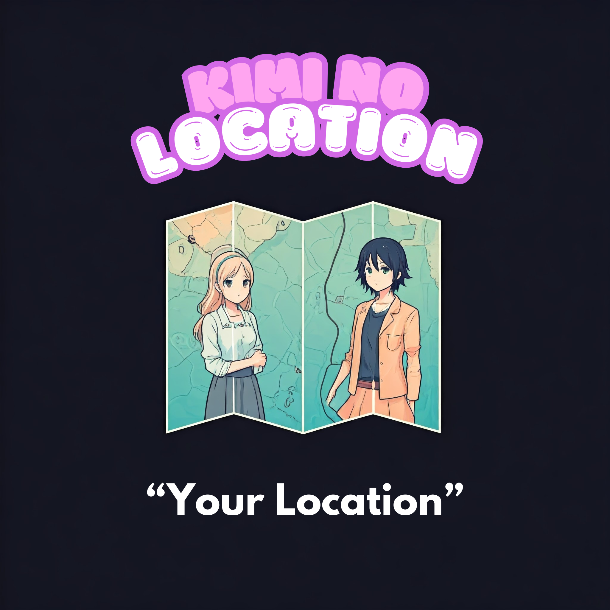

# Kimi No Location

**Welcome to Kimi No Location!**  
In Japanese, "Kimi No Location" means **"Your Location"**. This platform allows you to upload videos, extract location metadata, split videos into frames, and geo-tag them. It's built using modern web technologies to handle video uploads, frame extraction, and geolocation tagging efficiently.



## Features

- **Upload Videos:** Easily upload videos to the platform.
- **Extract Location:** Automatically extract location data embedded in the video file.
- **Frame Splitting:** Split videos into frames for detailed analysis.
- **Geo-Tagging:** Add geolocation information to individual frames or the entire video.
- **Responsive UI:** Built with shadcn and Nuxt for a smooth and modern user experience.

## Tech Stack

Kimi No Location is powered by the following technologies:

- **Frontend:** 
  - [Vue.js](https://vuejs.org/) (latest)
  - [Nuxt](https://nuxt.com/) `^3.13.0`
  - [Tailwind CSS](https://tailwindcss.com/) for styling
  - [Vue Router](https://router.vuejs.org/) for navigation
  - [Lucide Icons](https://lucide.dev/) for icons
  
- **Backend:**
  - [Knex.js](https://knexjs.org/) `^3.1.0` for SQL query building
  - [Objection.js](https://vincit.github.io/objection.js/) `^3.1.5` for database modeling
  - [SQLite3](https://www.sqlite.org/) `^5.1.7` for database management
  - [Formidable](https://www.npmjs.com/package/formidable) `^3.5.1` for handling file uploads

- **Utilities:**
  - [Axios](https://axios-http.com/) `^1.7.7` for HTTP requests
  - [VueUse](https://vueuse.org/) `^11.1.0` for Vue composables
  - [Tailwind Merge](https://github.com/dcastil/tailwind-merge) `^2.5.4` for merging Tailwind CSS classes
  - [TailwindCSS Animate](https://tailwindcss-animate.vercel.app/) `^1.0.7` for animations
  -  [ShadCN Nuxt](https://github.com/shadcn/shadcn-nuxt) `^0.10.4` for utility-based component styling


## Installation

To get started with Kimi No Location, follow the steps below:

1. **Clone the repository:**
   ```bash
   git clone https://github.com/your-username/kimi-no-location.git
   ```

2. **Navigate to project directory**
    ```bash
    cd kimi-no-location
    ```

3. **Install dependencies:**
   ```bash
   npm install
   ```

4. **Run Migrations:**
   ```bash
   npm run migrate
   ```

5. **Create folders for video uploads:**
   ```bash
   mkdir -p videos/
   ```

6. **Run the development server:**
   ```bash
    npm run dev
    ```

## License

This project is licensed under the MIT License. See the [LICENSE](LICENSE) file for more details.

## Contributing

Contributions are welcome! Feel free to open an issue or submit a pull request if you have any improvements to suggest.